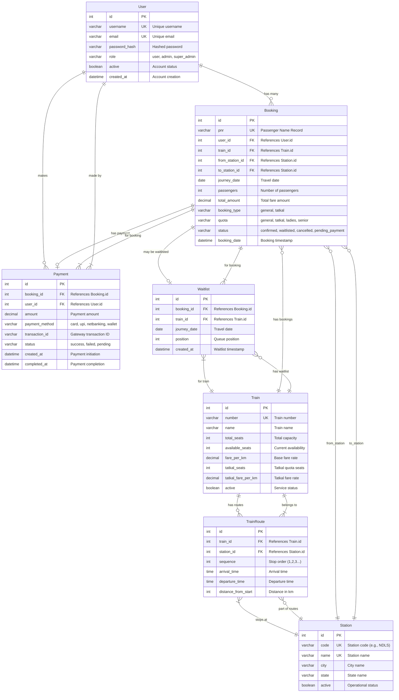

# RailServe Database Schema - ER Diagram



## Entity Relationships

### Primary Entities

1. **User**: System users with role-based access (user, admin, super_admin)
2. **Train**: Railway services with capacity and fare information
3. **Station**: Railway stations with geographic information
4. **Booking**: Ticket reservations linking users, trains, and stations

### Supporting Entities

1. **TrainRoute**: Defines train paths and schedules between stations
2. **Payment**: Transaction records for completed payments
3. **Waitlist**: FIFO queue management for overbooked trains

### Key Relationships

- **User to Booking**: One-to-many (users can have multiple bookings)
- **Train to Booking**: One-to-many (trains can have multiple bookings)
- **Booking to Payment**: One-to-one (each booking has one payment)
- **Train to TrainRoute**: One-to-many (trains have multiple stops)
- **Station to TrainRoute**: One-to-many (stations serve multiple trains)
- **Booking to Waitlist**: One-to-one optional (only waitlisted bookings)

### Business Rules Enforced

1. **Referential Integrity**: All foreign keys properly reference parent tables
2. **Unique Constraints**: 
   - User usernames and emails must be unique
   - Train numbers must be unique
   - Station codes and names must be unique
   - PNR numbers must be unique
3. **Data Validation**:
   - User roles restricted to defined values
   - Booking status follows defined state transitions
   - Payment status tracks transaction lifecycle
4. **Cascading Rules**:
   - User deactivation preserves booking history
   - Train deactivation preserves historical data
   - Payment deletion cascades from booking deletion

### Index Strategy

```sql
-- Performance indexes for common queries
CREATE INDEX idx_booking_user_id ON booking(user_id);
CREATE INDEX idx_booking_train_journey ON booking(train_id, journey_date);
CREATE INDEX idx_booking_status ON booking(status);
CREATE INDEX idx_train_route_train_sequence ON train_route(train_id, sequence);
CREATE INDEX idx_waitlist_train_journey_position ON waitlist(train_id, journey_date, position);
CREATE INDEX idx_payment_booking ON payment(booking_id);
CREATE INDEX idx_payment_status_created ON payment(status, created_at);
```

### Data Consistency

1. **Seat Allocation**: `Train.available_seats` updated atomically with bookings
2. **Payment Integrity**: Payment amounts match booking amounts
3. **Waitlist Management**: Position numbers maintained in sequence
4. **Route Validation**: Bookings validated against actual train routes