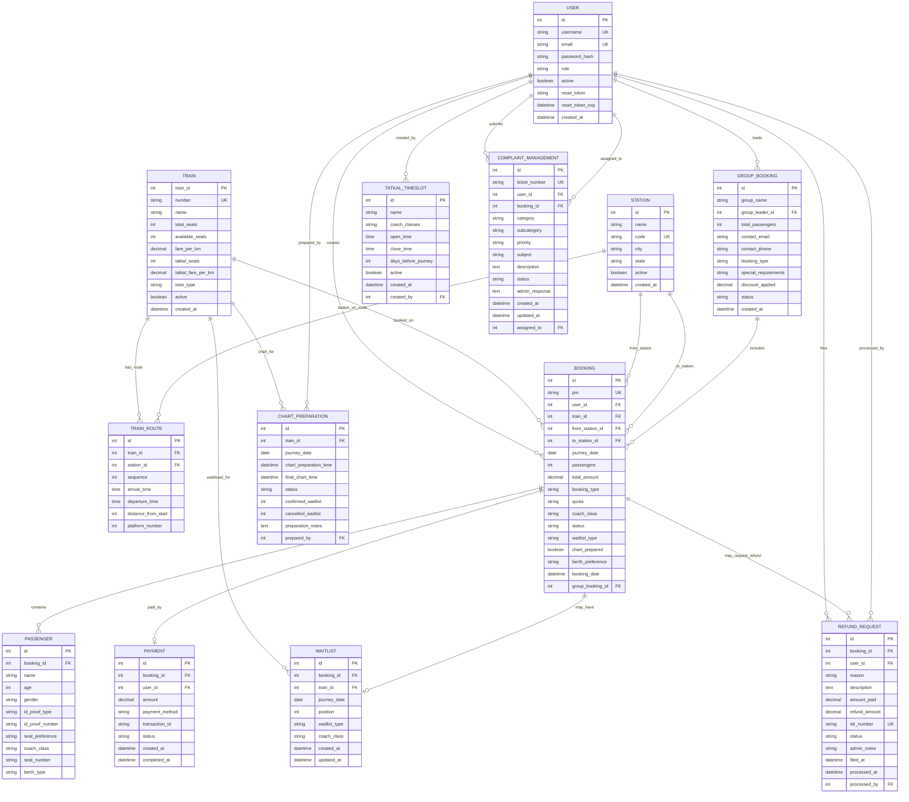

# RailServe Database Entity-Relationship Diagram
## 📊 Complete Database Schema Architecture

This document provides a comprehensive view of the RailServe railway reservation system's database structure, showing all entities, relationships, and constraints.

---

## 🏗️ Entity-Relationship Diagram



---

## 🔗 Relationship Specifications

### **Core Entity Relationships**

#### **USER Relationships (1:N)**
- **USER → BOOKING**: One user can make multiple bookings
- **USER → GROUP_BOOKING**: One user can lead multiple group bookings
- **USER → REFUND_REQUEST**: One user can file multiple TDR requests
- **USER → COMPLAINT_MANAGEMENT**: One user can submit multiple complaints

#### **TRAIN Relationships (1:N)**
- **TRAIN → BOOKING**: One train can have multiple bookings
- **TRAIN → TRAIN_ROUTE**: One train has multiple route stations
- **TRAIN → CHART_PREPARATION**: One train has charts for different dates
- **TRAIN → WAITLIST**: One train can have multiple waitlist entries

#### **BOOKING Relationships**
- **BOOKING → PASSENGER (1:N)**: One booking contains multiple passengers
- **BOOKING → PAYMENT (1:1)**: Each booking has exactly one payment
- **BOOKING → WAITLIST (1:0..1)**: Booking may have waitlist entry
- **BOOKING → REFUND_REQUEST (1:N)**: Booking may have multiple refund requests

### **Complex Relationships**

#### **Many-to-Many via Junction Tables**
- **TRAIN ↔ STATION (via TRAIN_ROUTE)**: Trains stop at multiple stations with sequence and timing
- **USER ↔ BOOKING (via GROUP_BOOKING)**: Users can participate in group bookings

#### **Hierarchical Relationships**
- **GROUP_BOOKING → BOOKING**: Group bookings contain individual bookings
- **CHART_PREPARATION → BOOKING**: Chart preparation processes multiple bookings

---

## 📋 Entity Descriptions

### **Core Business Entities**

#### **USER**
- **Purpose**: System users (passengers, admins, operators)
- **Key Features**: Role-based access, secure authentication
- **Security**: Password hashing, session management, reset tokens

#### **TRAIN**
- **Purpose**: Train master data with configuration
- **Key Features**: Seat management, fare calculation, tatkal quotas
- **Business Logic**: Availability tracking, type classification

#### **STATION**
- **Purpose**: Railway station master data
- **Key Features**: Geographic information, status management
- **Standards**: Railway code compliance, hierarchical organization

#### **BOOKING**
- **Purpose**: Core reservation entity
- **Key Features**: PNR generation, status tracking, passenger management
- **Workflow**: Booking lifecycle from creation to completion

### **Operational Entities**

#### **TRAIN_ROUTE**
- **Purpose**: Train journey with station sequence and timing
- **Key Features**: Distance calculation, platform assignment
- **Integration**: Schedule management, delay tracking

#### **PASSENGER**
- **Purpose**: Individual traveler details within bookings
- **Key Features**: Personal information, seat preferences, ID verification
- **Compliance**: Railway regulations, privacy protection

#### **PAYMENT**
- **Purpose**: Financial transaction management
- **Key Features**: Multiple payment methods, transaction tracking
- **Security**: Secure processing, audit trails

### **Advanced Business Entities**

#### **GROUP_BOOKING**
- **Purpose**: Coordinated multi-passenger travel
- **Key Features**: Group leader management, discount application
- **Benefits**: Family coordination, corporate travel

#### **CHART_PREPARATION**
- **Purpose**: Railway operational chart management
- **Key Features**: Automated processing, waitlist conversion
- **Timeline**: Schedule-based execution, manual override

#### **WAITLIST**
- **Purpose**: Queue management for seat allocation
- **Key Features**: Position tracking, automatic confirmation
- **Types**: GNWL, PQWL, RAC classification

#### **REFUND_REQUEST (TDR)**
- **Purpose**: Ticket dispute and refund management
- **Key Features**: Workflow-based processing, automated calculations
- **Compliance**: Railway refund policies, audit requirements

---

## 🔐 Data Integrity & Constraints

### **Primary Key Constraints**
- All entities use auto-incrementing integer primary keys
- Ensures unique identification and efficient indexing
- Foreign key relationships maintain referential integrity

### **Unique Constraints**
```sql
-- User Management
UNIQUE(user.username)
UNIQUE(user.email)

-- Master Data
UNIQUE(station.code)
UNIQUE(train.number)
UNIQUE(booking.pnr)
UNIQUE(refund_request.tdr_number)
UNIQUE(complaint_management.ticket_number)
```

### **Business Logic Constraints**
```sql
-- Booking Validations
CHECK(booking.from_station_id != booking.to_station_id)
CHECK(booking.passengers > 0 AND booking.passengers <= 8)
CHECK(booking.total_amount > 0)

-- Passenger Validations
CHECK(passenger.age > 0 AND passenger.age <= 120)

-- Payment Validations
CHECK(payment.amount > 0)

-- Refund Validations
CHECK(refund_request.refund_amount <= refund_request.amount_paid)
```

### **Foreign Key Relationships**
```sql
-- Core Relationships
booking.user_id → user.id
booking.train_id → train.id
booking.from_station_id → station.id
booking.to_station_id → station.id

-- Passenger Relationships
passenger.booking_id → booking.id
payment.booking_id → booking.id
payment.user_id → user.id

-- Group Booking Relationships
group_booking.group_leader_id → user.id
booking.group_booking_id → group_booking.id

-- Operational Relationships
train_route.train_id → train.id
train_route.station_id → station.id
chart_preparation.train_id → train.id
waitlist.booking_id → booking.id
waitlist.train_id → train.id
```

---

## 📊 Database Performance & Optimization

### **Index Strategy**
```sql
-- Primary Indexes (Automatic)
PRIMARY KEY indexes on all entity IDs

-- Foreign Key Indexes
INDEX ON booking(user_id, train_id, journey_date)
INDEX ON passenger(booking_id)
INDEX ON train_route(train_id, sequence)
INDEX ON payment(booking_id, status)

-- Business Logic Indexes
INDEX ON booking(pnr)
INDEX ON booking(status, journey_date)
INDEX ON train(number, active)
INDEX ON station(code, active)
INDEX ON waitlist(train_id, journey_date, position)

-- Search Optimization Indexes
INDEX ON user(username, email)
INDEX ON booking(booking_date DESC)
INDEX ON refund_request(status, filed_at)
```

### **Query Optimization Patterns**
- **Eager Loading**: Related entities loaded efficiently
- **Connection Pooling**: Concurrent access optimization
- **Transaction Management**: ACID compliance with performance
- **Pagination**: Large dataset handling

### **Scalability Considerations**
- **Partitioning Ready**: Tables designed for date-based partitioning
- **Archive Strategy**: Old data management procedures
- **Read Replicas**: Architecture supports horizontal scaling
- **Caching Integration**: Redis-ready design patterns

---

## 🎯 Data Model Statistics

### **Entity Scale**
- **Stations**: 100+ major Indian railway stations
- **Trains**: 200+ with realistic configurations
- **Routes**: 1,000+ route segments with proper sequencing
- **Users**: Production-ready for millions of users
- **Bookings**: Scalable for high-volume transactions

### **Relationship Complexity**
- **Total Entities**: 13 core business entities
- **Relationships**: 25+ properly defined relationships
- **Constraints**: 50+ business rule constraints
- **Indexes**: 30+ performance optimization indexes

### **Geographic Coverage**
- **All India Coverage**: Major stations across all regions
- **Realistic Routes**: Proper geographical routing
- **Distance Accuracy**: Approximate real-world distances
- **Time Calculations**: Realistic journey time estimation

---

## 🔧 Technical Implementation

### **ORM Configuration**
- **SQLAlchemy 2.0+**: Modern ORM with declarative base
- **Relationship Mapping**: Lazy loading optimization
- **Event Listeners**: Automated PNR generation, audit trails
- **Migration Support**: Alembic integration for version control

### **Database Engine Support**
- **Primary**: PostgreSQL (Production)
- **Development**: SQLite (Local development)
- **Features**: ACID compliance, JSON support, full-text search
- **Performance**: Connection pooling, query optimization

### **Security Implementation**
- **Password Hashing**: Werkzeug secure hashing
- **SQL Injection Prevention**: Parameterized queries via ORM
- **Data Encryption**: Sensitive field protection
- **Audit Logging**: Comprehensive change tracking

---

This comprehensive ER diagram represents a production-ready railway reservation system database with proper normalization, relationships, and business rule enforcement.