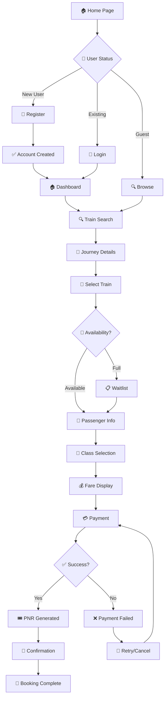
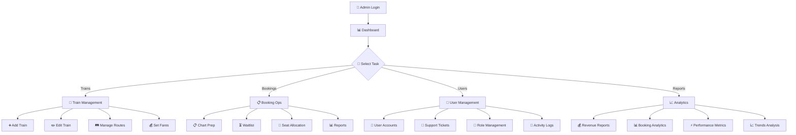
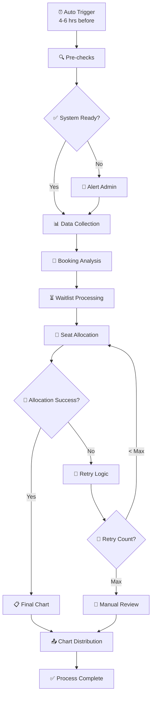
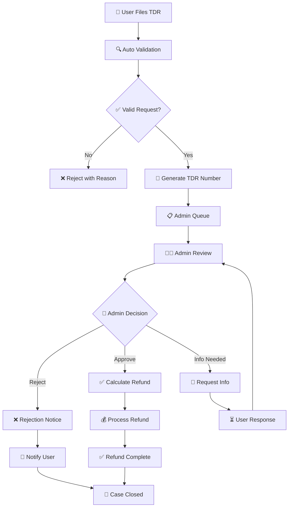
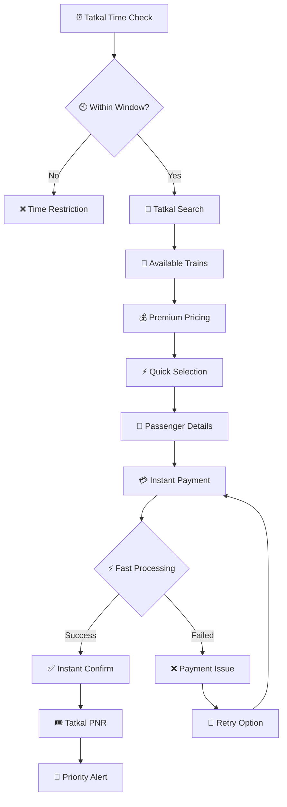
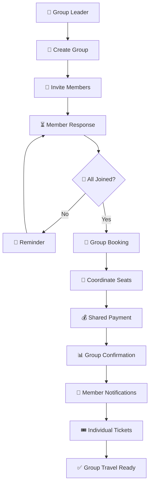
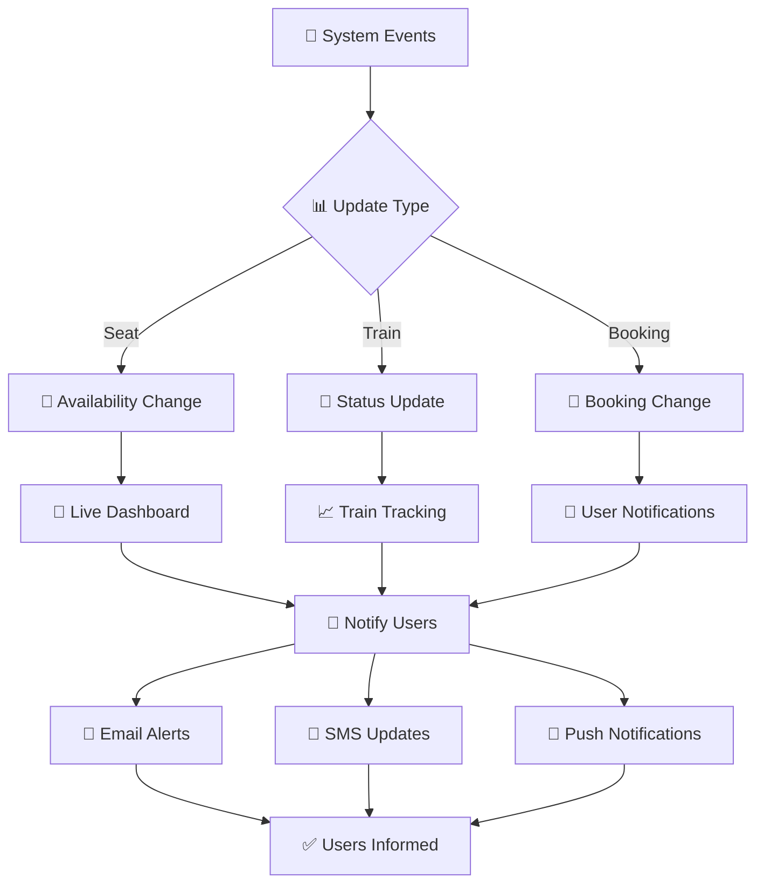
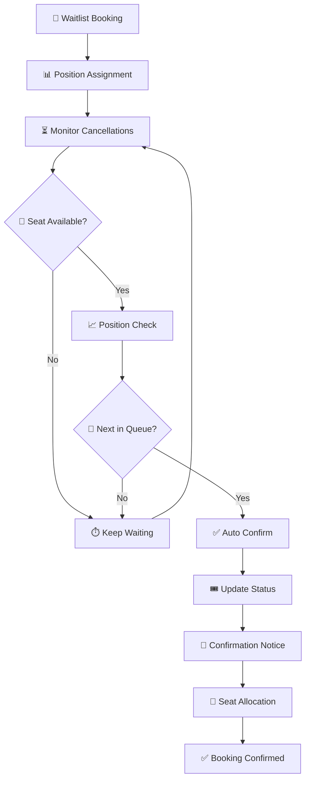

# RailServe System Flow Charts
## 🔄 Comprehensive Process Flow Documentation

This document provides detailed flow charts for all major processes in the RailServe railway reservation system.

---

## 🎫 Passenger Booking Flow

---

## 👨‍💼 Admin Management Flow

---

## 📋 Chart Preparation Process

---

## 🎟️ TDR (Refund) Process Flow

---

## ⚡ Tatkal Booking Flow

---

## 👥 Group Booking Flow

---

## 📱 Real-time Updates Flow

---

## 🔄 Waitlist Management Flow

This comprehensive flow documentation covers all major processes in the RailServe system, from user interactions to automated system operations.