# RailServe Project Mind Map
## 🧠 Comprehensive System Architecture & Features

```mermaid
mindmap
  root((🚂 RailServe))
    🎯 Core Features
      🎫 Booking System
        Real-time Availability
        Multi-passenger Support
        Group Bookings
        Tatkal Booking
      👤 User Management
        Registration/Login
        Profile Management
        Role-based Access
        Password Reset
      💳 Payment System
        Multiple Methods
        Secure Processing
        Refund Handling
        Transaction Tracking
      🔍 Search & Discovery
        Train Search
        Route Planning
        Fare Calculation
        Schedule Information
    
    🏗️ Technical Architecture
      📱 Frontend Layer
        HTML5/CSS3
        Responsive Design
        JavaScript (ES6+)
        Jinja2 Templates
      ⚙️ Backend Layer
        Flask Framework
        Python 3.11
        REST APIs
        Blueprint Structure
      🗄️ Database Layer
        PostgreSQL
        SQLAlchemy ORM
        13 Core Entities
        Complex Relationships
      🔒 Security Layer
        Authentication
        Authorization
        CSRF Protection
        Session Management
    
    👨‍💼 Administrative Features
      📊 Analytics Dashboard
        Real-time Statistics
        Revenue Tracking
        Performance Metrics
        Booking Reports
      🚆 Train Management
        Train Information
        Route Management
        Schedule Updates
        Fare Management
      👥 User Administration
        Customer Support
        Account Management
        Role Assignment
        Activity Monitoring
      📋 Operations Management
        Chart Preparation
        Waitlist Management
        Seat Allocation
        Emergency Quota
    
    🚀 Advanced Capabilities
      🤖 Automation
        Auto Seat Allocation
        Chart Processing
        Waitlist Management
        Dynamic Pricing
      📈 Real-time Features
        Live Availability
        Train Tracking
        Payment Processing
        Status Updates
      🔄 Integration
        Payment Gateways
        Email/SMS Services
        External APIs
        Monitoring Tools
      📱 User Experience
        Mobile Optimized
        Accessible Design
        Fast Loading
        Intuitive Interface
```

## 🎯 System Overview

### Core Business Functions
- **Complete Booking Lifecycle**: From search to confirmation with seat allocation
- **Multi-level User Management**: Passengers, admins, and super admins with role-based access
- **Advanced Payment Processing**: Multiple payment methods with secure transaction handling
- **Real-time Operations**: Live seat availability and train status updates

### Technical Excellence
- **Modern Web Stack**: Flask 3.1.2, Python 3.11, PostgreSQL with responsive frontend
- **Scalable Architecture**: Blueprint-based modular design for easy maintenance
- **Security First**: Multi-layered security with authentication, authorization, and CSRF protection
- **Performance Optimized**: Database indexing, connection pooling, and query optimization

### Business Intelligence
- **Comprehensive Analytics**: Revenue tracking, booking patterns, and performance metrics
- **Operational Efficiency**: Automated chart preparation and waitlist management
- **Customer Experience**: Intuitive interface with mobile optimization and accessibility
- **Enterprise Ready**: Production deployment configuration with monitoring and scaling

### Data Management
- **13 Core Entities**: Complete railway domain modeling with complex relationships
- **Data Integrity**: Foreign key constraints, unique constraints, and business rule validation
- **Comprehensive Coverage**: 1,250+ stations, 1,500+ trains, 7,762+ route segments
- **Real-time Sync**: Live data updates across all system components

This mind map represents the complete RailServe ecosystem, showcasing the integration between user experience, business logic, technical architecture, and operational excellence.