# RailServe Single Flow Chart
## Complete Railway Reservation System Workflow

```mermaid
graph TD
    A[🚂 RailServe Home Page] --> B{User Authentication}
    
    B -->|New User| C[📝 Registration Form]
    B -->|Existing User| D[🔐 Login Page]
    B -->|Guest| E[🔍 Browse Trains]
    
    C --> F[✅ Account Created]
    D --> G[🏠 User Dashboard]
    F --> G
    
    G --> H[🔍 Search Trains]
    E --> H
    
    H --> I[📅 Select Journey Details]
    I --> J{🚆 Train Selection}
    
    J --> K[💺 Check Seat Availability]
    K --> L{Seats Available?}
    
    L -->|Yes| M[👥 Add Passenger Details]
    L -->|No| N[📋 Waitlist Option]
    
    M --> O[🎫 Select Coach Class]
    N --> O
    
    O --> P[💰 Calculate Fare]
    P --> Q{💳 Payment Gateway}
    
    Q -->|Success| R[✅ Booking Confirmed]
    Q -->|Failed| S[❌ Payment Failed]
    
    R --> T[🎟️ Generate PNR]
    T --> U[📧 Send Confirmation]
    
    S --> V[🔄 Retry Payment]
    V --> Q
    
    U --> W[📱 User Dashboard Updated]
    W --> X{Additional Actions}
    
    X -->|Check PNR| Y[🔍 PNR Enquiry]
    X -->|Cancel Ticket| Z[❌ Cancellation]
    X -->|Book Again| H
    X -->|Group Booking| AA[👥 Group Management]
    X -->|File Complaint| BB[📝 Complaint System]
    
    Y --> CC[📊 Booking Status]
    Z --> DD[💸 Refund Processing]
    AA --> EE[👫 Invite Members]
    BB --> FF[🎫 Support Ticket]
    
    CC --> GG[📈 Live Train Status]
    DD --> HH[💰 Refund Confirmation]
    EE --> II[📅 Shared Booking]
    FF --> JJ[👨‍💼 Admin Review]
    
    %% Admin Flow
    JJ --> KK{👨‍💼 Admin Actions}
    KK --> LL[🚆 Train Management]
    KK --> MM[🏢 Station Management]
    KK --> NN[📊 Analytics Dashboard]
    KK --> OO[👥 User Management]
    KK --> PP[⚡ Tatkal Management]
    
    LL --> QQ[✏️ Add/Edit Trains]
    MM --> RR[🏗️ Route Management]
    NN --> SS[📈 Booking Reports]
    OO --> TT[👤 User Verification]
    PP --> UU[⏰ Time Slot Config]
    
    %% System Operations
    QQ --> VV[🔄 Database Updates]
    RR --> VV
    SS --> WW[📊 Data Export]
    TT --> XX[📧 User Communication]
    UU --> YY[⚡ Tatkal Availability]
    
    %% Integration Points
    VV --> ZZ[🔗 External APIs]
    ZZ --> AAA[🚆 IRCTC Integration]
    ZZ --> BBB[💳 Payment Gateway]
    ZZ --> CCC[📱 SMS/Email Service]
    
    %% Real-time Features
    YY --> DDD[⚡ Live Seat Updates]
    DDD --> EEE[📱 Push Notifications]
    EEE --> FFF[🔔 User Alerts]
    
    style A fill:#e1f5fe
    style R fill:#c8e6c9
    style S fill:#ffcdd2
    style T fill:#fff3e0
    style JJ fill:#f3e5f5
    style DDD fill:#fff8e1
```

## Flow Description

### 🎯 User Journey Flow
1. **Entry Point**: Users access RailServe through web interface
2. **Authentication**: Registration or login for personalized experience
3. **Search & Discovery**: Find trains based on journey requirements
4. **Booking Process**: Select trains, add passengers, choose classes
5. **Payment**: Secure payment processing with multiple options
6. **Confirmation**: PNR generation and booking confirmation
7. **Post-Booking**: Management, cancellation, and support options

### 🔧 Admin Management Flow
1. **System Administration**: Train, station, and route management
2. **User Management**: Account verification and support
3. **Analytics**: Performance monitoring and reporting
4. **Configuration**: Tatkal timings and system parameters

### ⚡ Real-time Operations
1. **Live Updates**: Seat availability and train status
2. **Notifications**: Instant alerts for booking changes
3. **Integration**: External APIs for enhanced functionality

### 🎫 Special Features
- **Group Bookings**: Collaborative trip planning
- **Tatkal Booking**: Premium rapid booking system
- **Waitlist Management**: Automatic confirmation system
- **Complaint System**: Integrated customer support

This single flow chart represents the complete journey from user entry to booking completion, including all administrative functions and real-time system operations.